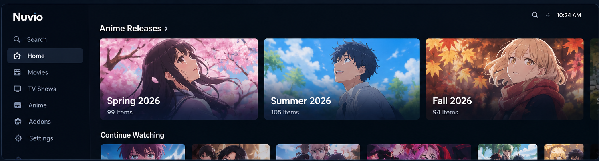

# Anime Releases for Nuvio

[](https://nuvio.tv)
[](https://anilist.co)
[](https://vercel.com)
[](https://github.com/mbmelgo/nuvio-anime-releases-addon/releases)

> A lightweight, season-aware anime release catalog for Nuvio and Stremio-compatible clients.

**Anime Releases for Nuvio** provides dynamically generated seasonal and rolling anime release catalogs using **AniList** as the catalog source. Anime are exposed with their canonical `anilist:<id>` identity, while detailed metadata and provider mapping are delegated to the metadata addon configured in the client.

---

## ✨ Features

### 📺 Seasonal Anime Catalogs

The addon currently exposes three seasonal catalogs:

- **Upcoming Season** — anime scheduled for the next season.
- **Current Season** — anime belonging to the current season.
- **Previous Season** — anime from the immediately preceding season.

All three catalogs use the same generalized AniList query model; only the requested season changes.

### ⏱️ Rolling Release Catalogs

The addon also exposes two rolling release catalogs:

- **Upcoming — 5 days** — unique anime with an upcoming airing schedule in the next five days.
- **Previous — 7 days** — unique anime with an airing schedule in the previous seven days.

Rolling catalogs use a separate AniList `Page.airingSchedules` pipeline, deduplicate by AniList media ID, and apply Nuvio pagination after deduplication.

### 🗂️ Broad Anime Format Coverage

Seasonal catalogs include these AniList anime formats:

- **TV**
- **TV Short**
- **ONA**
- **OVA**
- **Special**
- **Movie**

The catalog does **not** use a release-status filter, so entries remain associated with their season as they move from upcoming to releasing and finished.

### 🔑 Canonical AniList IDs

Every catalog item uses:

```text
anilist:<id>
```

This keeps the addon focused on catalog discovery and lets the downstream metadata addon resolve detailed information.

### 📄 Nuvio-Friendly Pagination

AniList requests use a **50-item page size**, matching the pagination model used by Nuvio.

Large seasonal catalogs can therefore be consumed page-by-page without introducing a separate addon-side pagination scheme.

Rolling catalogs apply pagination after schedule records have been deduplicated into unique anime.

### 🔎 Catalog Search

The catalog endpoint accepts Nuvio/Stremio catalog search requests and applies the search term to the AniList-backed catalog.

### 🌐 Dynamic Seasonal Windows

The addon determines the current, previous, and upcoming seasons dynamically from the current date rather than hard-coding specific seasons.

---

## 🖼️ What It Looks Like

These are **representative showcase images**, not screenshots of the Nuvio application. They illustrate the catalog flow using sample artwork from anime represented in the seasonal data.

### Seasonal Catalogs



### Season Listing


### Metadata Detail Flow


The important behavior illustrated here is the addon flow rather than exact Nuvio UI styling:

```text
AniList seasonal catalog
        ↓
anilist:<id>
        ↓
Nuvio
        ↓
configured metadata addon
```

---

## 🧩 Architecture

```text
                         ┌─────────────────────┐
                         │       AniList       │
                         │  Seasonal Catalog   │
                         └──────────┬──────────┘
                                    │
                                    ▼
                         ┌─────────────────────┐
                         │ Anime Releases      │
                         │     for Nuvio       │
                         │                     │
                         │ anilist:<id>        │
                         └──────────┬──────────┘
                                    │
                                    ▼
                         ┌─────────────────────┐
                         │       Nuvio         │
                         └──────────┬──────────┘
                                    │
                                    ▼
                         ┌─────────────────────┐
                         │ Metadata Addon      │
                         │ IOMetadata /        │
                         │ AIOMetadata /       │
                         │ configured provider │
                         └─────────────────────┘
```

The addon is intentionally **catalog-focused**. It does not duplicate the detailed metadata/provider-mapping functionality handled downstream.

The previous AniBridge compatibility path is not part of the current production architecture.

---

## 📦 Installation

Use the production manifest URL:

```text
https://nuvio-anime-releases-addon-rho.vercel.app/manifest.json
```

Add the manifest to your supported Nuvio/Stremio client.

Production landing page:

```text
https://nuvio-anime-releases-addon-rho.vercel.app/
```

---

## 📋 Production Catalogs

The current production addon exposes these catalog endpoints:

| Catalog | Endpoint |
| --- | --- |
| Upcoming Season | `/catalog/anime/upcoming_season.json` |
| Current Season | `/catalog/anime/current_season.json` |
| Previous Season | `/catalog/anime/previous_season.json` |
| Upcoming — 5 days | `/catalog/anime/upcoming_5_days.json` |
| Previous — 7 days | `/catalog/anime/previous_7_days.json` |

The season represented by each endpoint is calculated dynamically.

---

## ✅ Release State

**Current production version:** `v4.2.0`  
**Development version:** `v4.2.2`  
**Major baseline:** `v4.0.0`

The 2026 seasonal baselines validated during the `v4.0.0` production release are:

| Season | Anime |
| --- | ---: |
| Spring 2026 | **99** |
| Summer 2026 | **105** |
| Fall 2026 | **94** |

These counts correspond to the AniList seasonal query using the six supported anime formats described above.

---

## 🚀 Releases

Production releases are published as GitHub Releases alongside their production release tags.

**GitHub Releases:** https://github.com/mbmelgo/nuvio-anime-releases-addon/releases

Every **MINOR** production deployment creates a corresponding release entry with a human-readable summary of the changes included in that release.

Semantic versioning is used:

- **PATCH** — normal meaningful changes.
- **MINOR** — production deployments.
- **MAJOR** — deliberate architectural or project-baseline changes.

Current major baseline:

```text
v4.0.0
```

---

## 🔧 Development

This project is a small serverless JavaScript addon designed for Vercel.

### Requirements

- Node.js **20+**
- npm

### Run tests

```bash
npm test
```

### Project structure

```text
api/
  catalog-source.js
  home-selector.js
  resolver-manifest.js
  version.js

lib/
  catalog configuration, AniList querying, and catalog normalization

test/
  automated tests

ops/
  release state and deployment bookkeeping
```

---

## 🚦 Release Workflow

Production releases follow the repository release pipeline:

```text
Change
  ↓
Tests
  ↓
GitHub Actions CI
  ↓
Controlled Vercel deployment
  ↓
Production smoke test
  ↓
Git tag
  ↓
GitHub Release
  ↓
Release-state update
```

---

## ⚠️ Known External Behavior

Detailed anime metadata is provided by downstream metadata services rather than this addon.

As a result, an individual anime may occasionally experience an upstream metadata error or delayed resolution even when the anime is present and correctly identified in the catalog. Such behavior is outside the catalog identity path and is not worked around by reintroducing provider-mapping logic into this addon.

---

## 📄 Scope

This addon is responsible for:

- seasonal anime catalog discovery
- rolling upcoming/recent airing catalog discovery
- AniList-based anime identities
- catalog pagination
- catalog search
- seasonal catalog organization

It is **not** a replacement for a detailed anime metadata/provider addon.

---

## 📜 License

This project is licensed under the MIT License. See [LICENSE](LICENSE) for the full license text.
