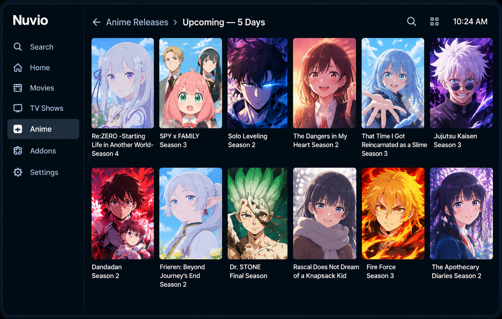
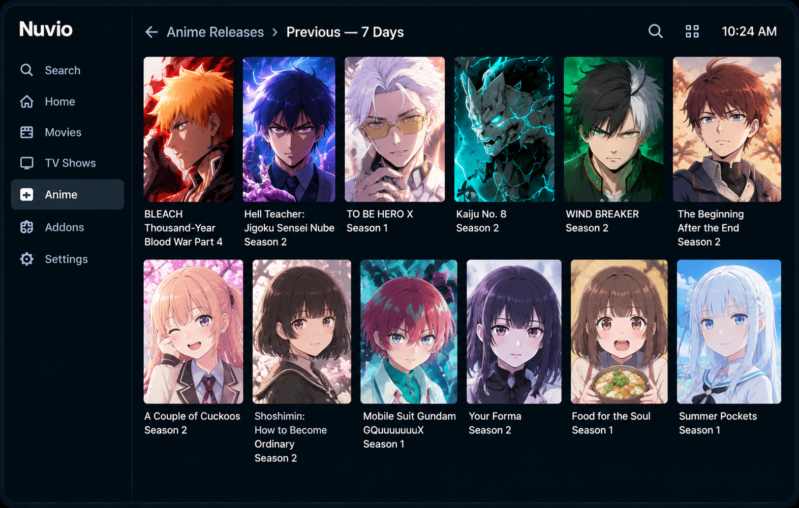

# Anime Releases for Nuvio

[](https://nuvio.tv)
[](https://myanimelist.net)
[](https://vercel.com)
[](https://github.com/mbmelgo/nuvio-anime-releases-addon/releases)

> A lightweight, season-aware anime release catalog for Nuvio and Stremio-compatible clients.

**Anime Releases for Nuvio** discovers anime releases from **AniList** and exposes **MAL identities when available**, with an `anilist:<id>` fallback when MAL is unavailable. Detailed anime metadata and provider mapping are intentionally delegated to the metadata addon configured in the client.

## ✨ Features

### 📺 Seasonal catalogs

The addon dynamically exposes:

- **Upcoming Season**
- **Current Season**
- **Previous Season**

The season windows are calculated from the current date rather than hard-coded to a particular year.

### ⏱️ Rolling release catalogs

Two rolling catalogs complement the seasonal views:

- **Upcoming — 5 days** — unique anime with an upcoming airing within the next five days.
- **Previous — 7 days** — unique anime with an airing within the previous seven days.

Rolling catalogs use AniList airing schedules, deduplicate by anime, and paginate the resulting unique catalog for Nuvio.

### 🔑 MAL-first catalog identity

Catalog items normally use:

```text
mal:<id>
```

When AniList has no valid MAL id, the item falls back to:

```text
anilist:<id>
```

The catalog keeps the AniList source id in the item's extra metadata so downstream systems can correlate the entry when needed.

### 📄 Nuvio pagination

- AniList seasonal pages use **50 items**, matching the Nuvio catalog page size.
- Rolling catalogs paginate **after** schedule records are filtered and deduplicated.
- Nuvio search parameters are supported by the catalog endpoints.

### 🎞️ Supported anime formats

Seasonal catalog discovery includes:

- TV
- TV Short
- ONA
- OVA
- Special
- Movie

Adult entries are excluded.

## 🖼️ What it looks like

The repository includes representative Nuvio-style screenshots for the addon views.

### Seasonal catalogs


### Season listing


### Rolling catalogs

#### Upcoming — 5 days



#### Previous — 7 days



The rolling views are intentionally shown separately so the upcoming and previous release sets are clear.

### Metadata detail flow


The production flow is:

```text
AniList release discovery
        ↓
mal:<id> (or anilist:<id> fallback)
        ↓
Nuvio catalog
        ↓
configured metadata addon
```

## 🧩 Architecture

```text
┌──────────────────────┐
│       AniList        │
│ release / airing data│
└──────────┬───────────┘
           │
           ▼
┌──────────────────────┐
│ Anime Releases       │
│      for Nuvio       │
│ MAL-first identities │
└──────────┬───────────┘
           │
           ▼
┌──────────────────────┐
│        Nuvio         │
└──────────┬───────────┘
           │
           ▼
┌──────────────────────┐
│ Configured metadata  │
│       addon          │
└──────────────────────┘
```

This addon is intentionally **catalog-focused**. It does not duplicate detailed metadata, provider mapping, or playback resolution.

## 📦 Installation

### Production manifest

```text
https://nuvio-anime-releases-addon-rho.vercel.app/manifest.json
```

Add the manifest URL to a supported Nuvio/Stremio client.

### Production landing page

```text
https://nuvio-anime-releases-addon-rho.vercel.app/
```

The landing page provides the manifest, current catalog endpoints, release information, and representative screenshots.

## 📋 Production catalogs

| Catalog | Endpoint |
| --- | --- |
| Upcoming Season | `/catalog/anime/upcoming_season.json` |
| Current Season | `/catalog/anime/current_season.json` |
| Previous Season | `/catalog/anime/previous_season.json` |
| Upcoming — 5 days | `/catalog/anime/upcoming_5_days.json` |
| Previous — 7 days | `/catalog/anime/previous_7_days.json` |

Catalog names and season labels are generated dynamically.

## 🚀 Current release

**Production:** `v5.5.0`  
**Development:** `v5.5.3`  
**Major baseline:** `v5.0.0`

v5.4.0 promotes MAL identity to the primary catalog identity while retaining AniList as the fallback. The rolling upcoming and previous catalogs remain part of the production addon.

Production releases are published as Git tags and GitHub Releases.

**Releases:** https://github.com/mbmelgo/nuvio-anime-releases-addon/releases

Versioning:

- **PATCH** — meaningful development changes.
- **MINOR** — production deployments.
- **MAJOR** — deliberate project or architectural baseline changes.

## 🔧 Development

This is a small serverless JavaScript addon designed for Vercel.

### Requirements

- Node.js **20+**
- npm

### Run tests

```bash
npm test
```

### Project structure

```text
api/
  catalog-source.js
  home-selector.js
  resolver-manifest.js
  version.js

lib/
  catalog-anilist.js
  catalog-config.js
  catalog-meta.js
  catalog-pagination.js

scripts/
  release-target.mjs

test/
  automated regression and release tests

ops/
  release-state.json

docs/images/
  representative Nuvio showcase images
```

## 🚦 Release pipeline

Production releases follow:

```text
Change
  ↓
Tests
  ↓
GitHub Actions CI
  ↓
Controlled Vercel deployment
  ↓
Production smoke test
  ↓
Git tag + GitHub Release
  ↓
Release-state update
```

## 📄 Scope

This addon is responsible for:

- seasonal anime release discovery
- rolling upcoming/recent airing discovery
- MAL-first catalog identities with AniList fallback
- Nuvio-compatible catalog pagination
- catalog search
- dynamic seasonal organization

It is **not** a replacement for a detailed anime metadata/provider addon.

## 📜 License

This project is licensed under the MIT License. See [LICENSE](LICENSE) for the full license text.
